# InterzoneXXL v0.1.1

**Valley Audio's Interzone synth voice, played from MIDI in mono or poly and patched with its own LFOs, random
sources and sequencers, running natively inside MPC OS on the Akai Force.**

InterzoneXXL is a VST2 instrument for MPC OS's built-in plugin host, made by L'Cronx (shown on the device as
**InterzoneXXL** by **ANDREALPHEUS**). It is a port of **Interzone**, Dale Johnson's classic monosynth voice for VCV
Rack: a VCO with glide, pitch modulation, pulse-width modulation and a sub wave, a mixer with noise, a resonant 2/4-pole
OTA filter with a high-pass, an LFO with seven waves, a looping envelope and a VCA. The pages are the module's panel,
drawn from Valley's own artwork, sliders where the module has sliders, knobs where it has knobs, switches where it has
switches. On VCV Rack, Interzone comes alive through what is patched into its jacks; a Force has no cables, so, as in
[PlateauXXL](https://github.com/sunskiefer/PlateauXXL), every input jack picks a source running inside the plugin.

> [!NOTE]
> **Status: 0.1.1, tested on an Akai Force** (MPC OS 3.9.1 with MockbaMod). Offline, the plugin's output is also
> compared, sample for sample, with Valley's own Interzone module code fed the same notes and the same patch cables
> (x86, ASan + UBSan). Report anything odd under [Issues](../../issues).

| | |
| --- | --- |
| 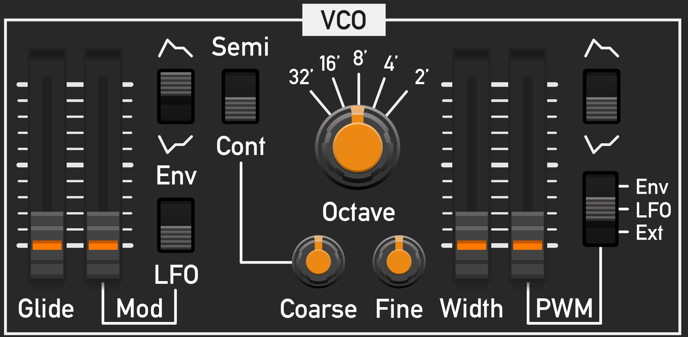 | 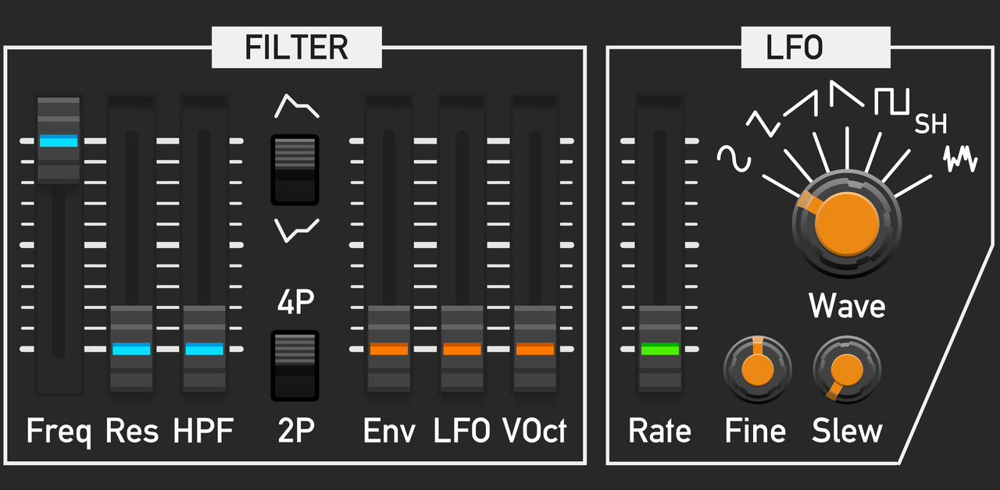 |
| 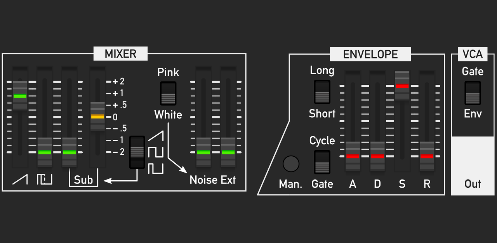 | 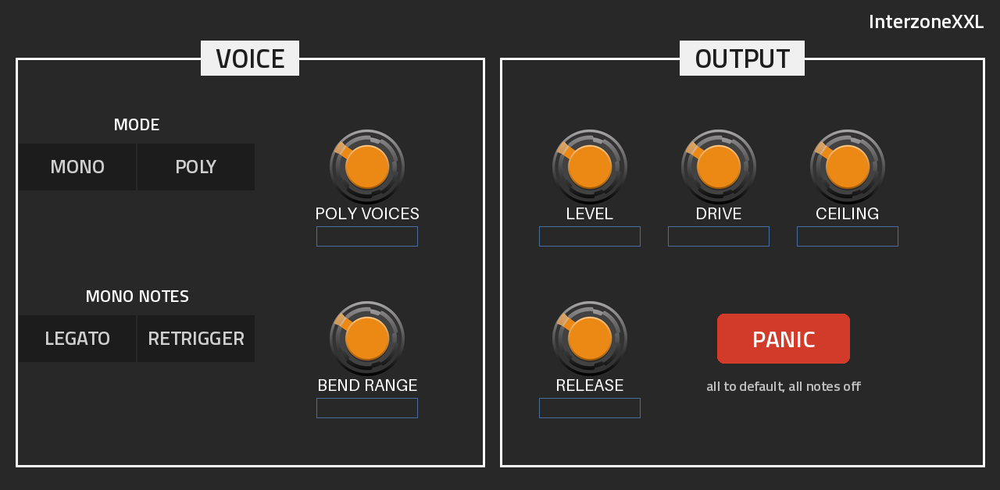 |
| 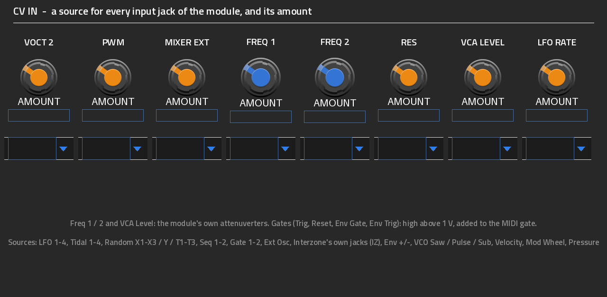 | 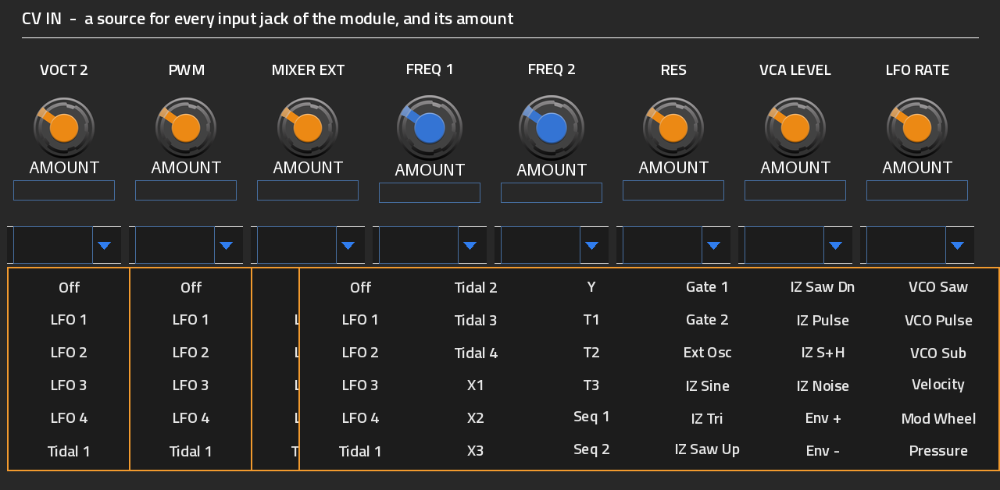 |
| 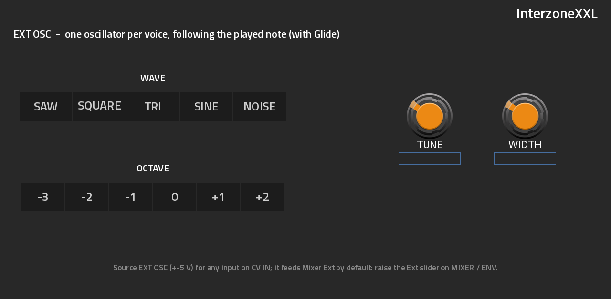 | 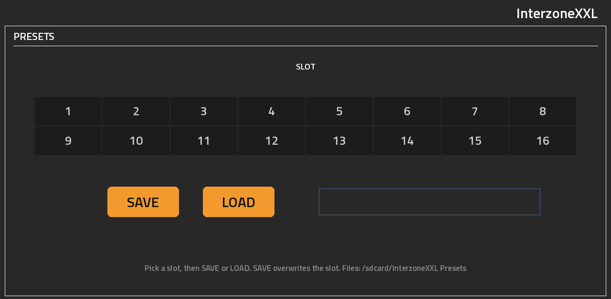 |
| 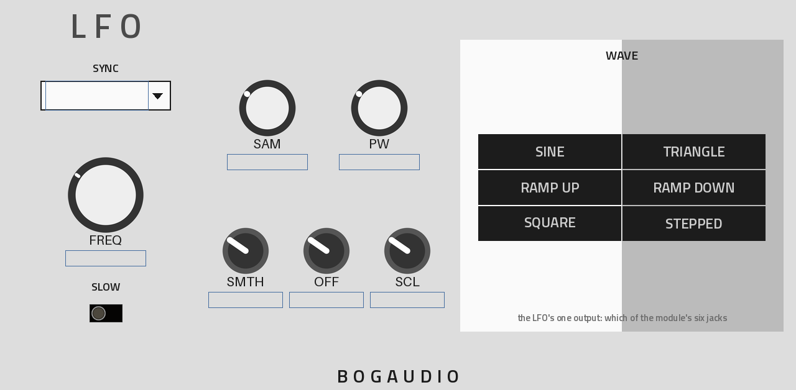 | 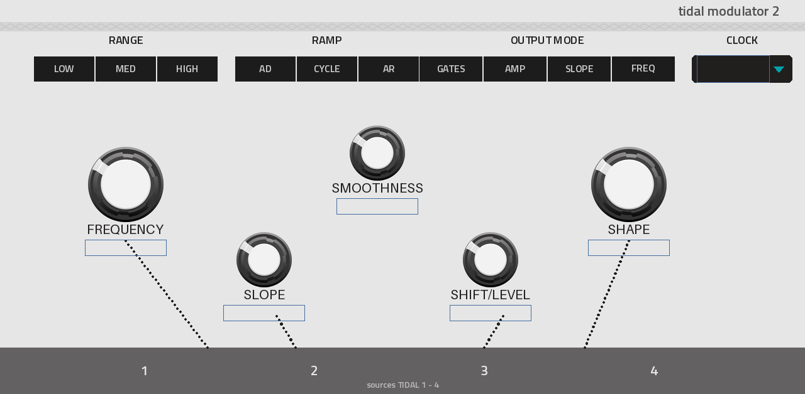 |
| 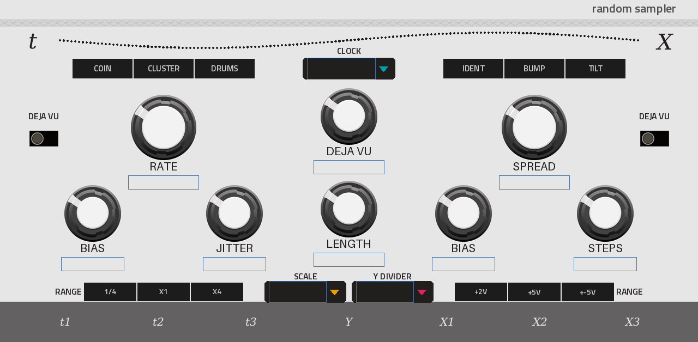 | 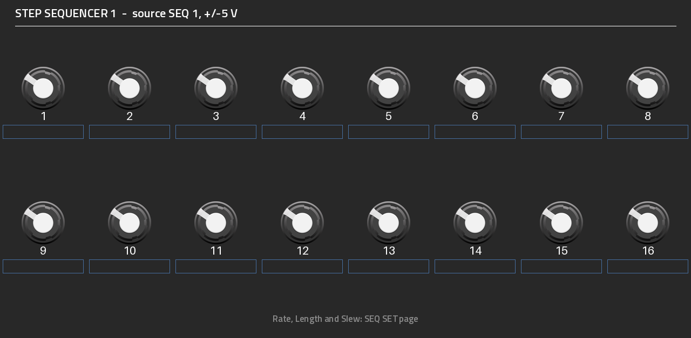 |
| 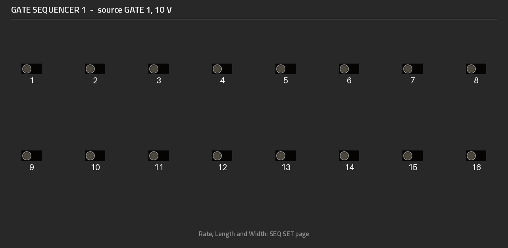 | 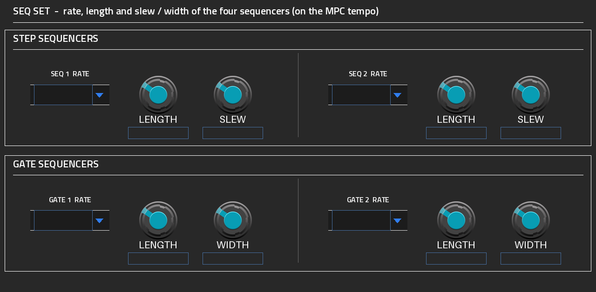 |

*The pages, rendered offline from the skin (on the device MPC fills in the values).*

## Highlights

- **Interzone, the voice:** Valley's own DSP (VecDirectOsc, VecOTAFilter, VecLoopingADSR, DLFO), and the module's
  process() re-written for MPC OS line by line. The tests check the result against the module itself.
- **Mono or Poly:** Mono is one voice, last-note priority, Legato (glide between held notes, no retrigger) or
  Retrigger. Poly is Interzone's own polyphony (its DSP runs four voices per SIMD group) with 1 to 16 voices, the
  oldest note stolen when they are all busy. Pitch bend (0-24 semitones) and the sustain pedal work in both.
- **The module's panel:** VCO, FILTER / LFO and MIXER / ENV pages, each a piece of Interzone's dark panel with
  Valley's sliders, Rogan knobs and VCV's switches at the module's own positions; values above the sliders.
- **Every input jack patched:** VOct 2, PWM, Mixer Ext, Filter Freq 1 and 2 (with the module's blue
  attenuverters), Res, VCA Level (with its attenuverter), LFO Rate, Trig and Reset, Env Gate and Trig each pick a
  source and have an amount, on the **CV IN** page, as if a cable were plugged in.
- **The sources (PlateauXXL's):** four **Bogaudio LFOs**, **Tidal Modulator 2** (Mutable Tides 2), **Random
  Sampler** (Mutable Marbles), two 16-step **CV sequencers** and two 16-step **gate sequencers**, locked to the MPC
  tempo if you like; plus Interzone's own output jacks (its LFO's seven waves, the envelope + and -, the VCO's saw,
  pulse and sub, per voice in Poly), MIDI velocity, mod wheel and pressure.
- **Ext Osc:** a simple oscillator per voice that follows the played note (saw, square, triangle, sine or noise,
  -3 to +2 octaves, tune, width); it feeds Mixer Ext by default, so the Ext slider is a second oscillator or a
  sub. Patch it anywhere else too.
- **A gate sequencer plays the voice:** Env Gate's source gates the envelope even with no key down, Env Trig's
  retriggers held notes, Seq 1 / 2 into VOct 2 transposes: an internal sequenced synth.
- **VOICE page:** voice mode, poly voices, mono retrigger, bend range, output level, RMXXXL's brickwall limiter
  (Drive, Ceiling, Release) and **Panic** (one tap back to the defaults, every note off). **EXT OSC** and
  **PRESETS** (16 slots of your own) on the same tab.
- **Q-Links:** every control on a Q-Link (the Interzone pages read left to right, bank 1 = Q-Links 1-8,
  bank 2 = 9-16).
- **Sample-accurate notes:** sequenced notes start at their exact position in the audio block.

## Requirements

- An **Akai Force** (first generation). Other first-generation MPC OS units (MPC Live / Live II, One, X,
  Key 61) should work but are untested.
- **Root SSH access** to the device, for example through MockbaMod. Stock MPC OS can't install third-party
  plugins.
- **MPC OS 3.x.** The skin uses the 3.x format.

## Installation

Download `InterzoneXXL-<version>-mpc-armv7.zip` from [Releases](../../releases), or build it (below). Unzip it and
follow the `INSTALL.md` inside. In short:

```
scp -r InterzoneXXL-<version> root@<device-ip>:/tmp/
ssh -t root@<device-ip> sh /tmp/InterzoneXXL-<version>/install.sh
```

The installer asks for confirmation (`-y` skips it), **stops MPC** (save your project first), copies the plugin to
`/sdcard/Synths/ANDREALPHEUS - VST - InterzoneXXL/`, backs up and edits `MPC.settings`, and starts MPC again. Then
load **InterzoneXXL** (manufacturer ANDREALPHEUS) as a plugin instrument on a track. `uninstall.sh` removes it.
Presets go in `/sdcard/InterzoneXXL Presets` (created on the first save), outside the plugin folder, so they
survive updates.

## Building

Linux or WSL with Python 3 (+ Pillow, cairosvg), gcc and [Zig](https://ziglang.org/)
(`pip install ziglang pillow cairosvg`). No Docker.

```
git clone --recursive https://github.com/sunskiefer/InterzoneXXL
cd InterzoneXXL
./build.sh                # build/arm/interzonexxl.so + the skin -> build/package/
test/run_tests.sh         # the framework's host test + the engine against Valley's module, under ASan/UBSan
tools/device_bench.sh <device-ip>   # CPU on the device, Mono and Poly 16 (nothing is installed)
```

- `tools/gen_params.py` is the single source of the parameter list (`params.json`, `src/param_ids.h`). MPC stores
  automation by parameter index, so parameters are appended only.
- `tools/panel.py` places every control where the module has it; `tools/layout.py` writes `layout.conf` from it, and
  `tools/panel_art.py` draws the Interzone pages from Valley's and VCV's artwork (`art/`). The source pages come
  from PlateauXXL (`tools/source_pages.py`, `tools/knob_art.py`, `tools/post_skin.py`).

## Related projects

- [mpc-vst-plugins](https://github.com/sd88me/mpc-vst-plugins) by sd88me: the framework InterzoneXXL is built on,
  and the plugin catalog.
- [PlateauXXL](https://github.com/sunskiefer/PlateauXXL) and [RMXXXL](https://github.com/sunskiefer/RMXXXL) by the
  same author: the patching, the sources and sequencers, the presets, the limiter, Panic and the Q-Link handling come
  from them.
- [ValleyRackFree](https://github.com/ValleyAudio/ValleyRackFree), [BogaudioModules](https://github.com/bogaudio/BogaudioModules)
  and [Audible Instruments](https://github.com/VCVRack/AudibleInstruments): the VCV Rack modules InterzoneXXL ports.

## License

InterzoneXXL is released under the **GNU GPL v3.0 or later** ([LICENSE](LICENSE)), as the Valley and VCV Rack code
it includes. Third-party components keep their own licenses (below). The artwork includes VCV Component Library
graphics (CC BY-NC 4.0), so InterzoneXXL is free and must not be sold.

## Credits

- **Interzone:** Dale Johnson, [Valley Audio](https://github.com/ValleyAudio/ValleyRackFree) (GPL-3.0-or-later). The
  DSP is vendored in `third_party/valley` with one local change, shared filter tables
  ([VENDORED.md](third_party/valley/VENDORED.md)); the module's control layer is re-written for MPC OS in
  `src/engine.cc`.
- **VCV Rack's SIMD and DSP headers:** VCV (GPL-3.0-or-later), unchanged in `third_party/rack`
  ([VENDORED.md](third_party/rack/VENDORED.md)).
- **SIMDe:** Evan Nemerson and contributors (MIT), the SSE-on-NEON layer Rack uses on ARM, in `third_party/simde`.
- **LFO:** Matt Demanett, [Bogaudio](https://github.com/bogaudio/BogaudioModules) (GPL-3.0-or-later), vendored
  unchanged in `third_party/bogaudio`.
- **Tidal Modulator 2 and Random Sampler:** Emilie Gillet, Mutable Instruments Tides 2 and Marbles (MIT), from VCV's
  fork of the eurorack code, in `third_party/mutable`; the module glue follows VCV Audible Instruments
  (GPL-3.0-or-later).
- **Patching, sources, sequencers, presets, brickwall limiter, Panic, Q-Link handling:** from
  [PlateauXXL](https://github.com/sunskiefer/PlateauXXL) and [RMXXXL](https://github.com/sunskiefer/RMXXXL) by
  L'Cronx (GPL-3.0-or-later).
- **VST2 wrapper, skin generator, installer:** sd88me ([mpc-vst-plugins](https://github.com/sd88me/mpc-vst-plugins))
  (MIT), as a submodule in `third_party/mpc-vst-plugins`.
- **Artwork** (`art/`): Interzone's panel, Valley's sliders and Rogan knobs (ValleyRackFree), VCV's switches and
  Rogan knobs (VCV Component Library, CC BY-NC 4.0), Bogaudio's knobs (CC BY-SA 4.0); see [art/README.md](art/README.md).
- **Interface font:** [Titillium Web](https://fonts.google.com/specimen/Titillium+Web), SIL Open Font License 1.1.

InterzoneXXL is not affiliated with or endorsed by Valley Audio, Bogaudio, Mutable Instruments, VCV or Akai
Professional.
